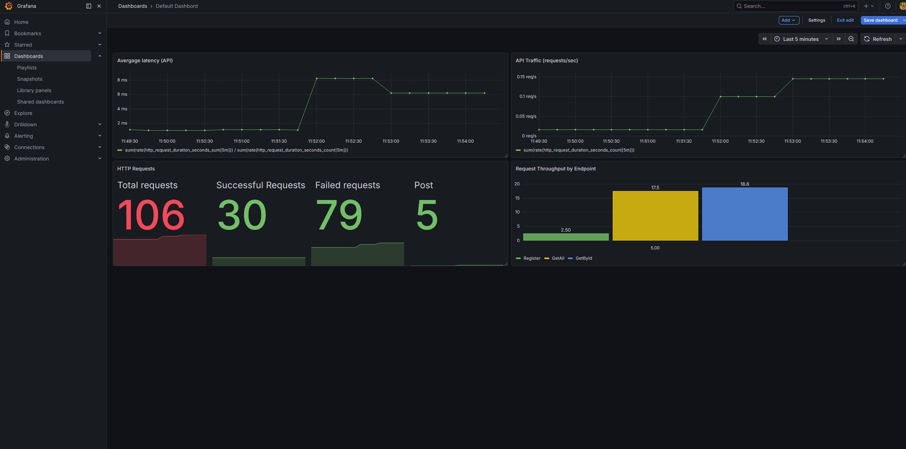
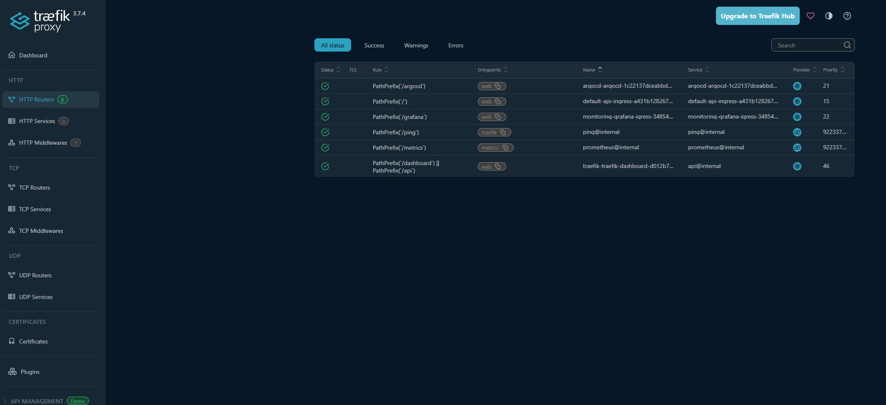

[](https://github.com/DennisNevback/DevOps-project/actions/workflows/test-api.yml)

# 🚀 DevOps Platform Demo

A portfolio project demonstrating containerization, Kubernetes deployments, GitOps (ArgoCD), ingress routing with Traefik, monitoring, and automated validation using GitHub Actions.

---

## Observability Dashboard

The platform includes a Grafana dashboard showing API traffic and latency.



Traefik Dashboard



## 🧩 Overview

This project showcases a complete cloud-native DevOps platform built around a containerized .NET API running on Kubernetes.

The platform demonstrates a modern Kubernetes-based architecture including GitOps workflows, ingress routing, and observability tooling.

The platform includes:

A containerized .NET API
SQL Server running in Kubernetes
Kubernetes deployments and services
GitOps tooling with ArgoCD (installed)
Ingress routing using Traefik (IngressRoute CRDs)
Monitoring with Prometheus and Grafana
Automated local environment setup via script
Automated validation using GitHub Actions

The goal of the project is to demonstrate practical DevOps and platform engineering concepts using modern cloud-native tooling.

---

## ⚡ Quick Start

Clone the repository and start the platform locally:

```bash
git clone https://github.com/DennisNevback/DevOps-project
cd scripts
./demo.sh
```

The startup script will:

- Start a local Kubernetes cluster using Minikube
- Build required Docker images
- Deploy the application to Kubernetes
- Install Prometheus and Grafana using Helm
- Automatically provision Grafana dashboards for observability
- Configure monitoring components

Grafana is available on port `3000`.

---

🌐 Access the Platform

Once running, all services are exposed through Traefik:

Grafana → http://localhost:8080/grafana
ArgoCD → http://localhost:8080/argocd
Traefik Dashboard → http://localhost:8080/dashboard
API Swagger → http://localhost:8080/swagger
API Endpoint → http://localhost:8080/api/worldcity

All routing is handled via Traefik IngressRoute CRDs (no NodePorts required for application services).

---

## 🔄 Continuous Integration

The project includes a GitHub Actions workflow that automatically validates the platform on every push and pull request.

The pipeline performs the following steps:

1. Build the API Docker image
2. Create a Kubernetes cluster using Kind
3. Load the Docker image into the cluster
4. Deploy SQL Server
5. Deploy the API
6. Wait for Kubernetes workloads to become ready
7. Expose the API through port forwarding
8. Execute API integration tests

The integration tests currently verify:

- Successful deployment of the application
- API availability after deployment
- Creation of data through the API
- Retrieval of data through the API

This ensures that the application is functional after being deployed to Kubernetes.

---

## 🏗️ Architecture

The platform consists of:

### Application Layer

- .NET API
- SQL Server database

### Platform Layer

- Kubernetes
- Minikube (local environment)
- Kind (CI environment)

### Monitoring Layer

- Prometheus
- Grafana

Kubernetes resources include:

- Deployments
- Services
- Secrets
- Namespaces

---

## 📊 Observability

The project includes a monitoring stack built with:

- Prometheus for metrics collection
- Grafana for visualization

Application metrics are exposed through the `/metrics` endpoint and can be viewed through Grafana dashboards.

---

## 📁 Project Structure

```text
DevOps-project/
├── apps/
│   └── api/
├── k8s/
│   ├── deployments/
│   ├── services/
│   ├── secrets/
│   └── ingress/   # Traefik IngressRoute resources
├── helm/
│   ├── prometheus/
│   ├── grafana/
│   ├── traefik/
│   └── argocd/
├── scripts/
│   └── demo.sh
└── .github/
    └── workflows/
        └── validate-api.yml
```

---

## ⚙️ Technologies Used

- Docker
- Kubernetes
- Minikube
- Kind
- Helm
- Traefik
- ArgoCD
- GitHub Actions
- Prometheus
- Grafana
- .NET
- SQL Server

---

## 🎯 What This Project Demonstrates

- Containerization with Docker
- Kubernetes deployments
- Service-to-service communication
- Infrastructure as code principles
- Monitoring and observability
- Automated environment provisioning
- CI-driven deployment validation
- API integration testing in Kubernetes
- GitOps tooling (ArgoCD installed)

---

## 📌 Future Improvements

Potential future enhancements include:

- Terraform integration
- OpenTelemetry tracing
- Container registry publishing
- Automated release workflows

---

## 👤 Author

Created as a DevOps portfolio project to demonstrate practical experience with Kubernetes, containerization, CI/CD automation, and modern platform tooling.
